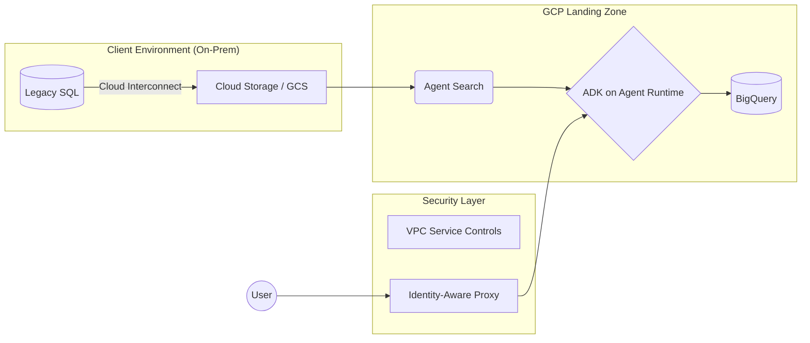

# Module 3 — Cloud Landing Zones

**Time:** ~5 hours · **You'll be able to:** sketch a secure landing zone for any mission, ask the right identity/network/perimeter questions, and explain why "infrastructure as code" is how you earn trust from a security team.

[← Module 2](02-data-foundations.md) · [Course home](README.md) · [Next: Module 4 →](04-enterprise-rag.md)

---

## The big idea

FDEs get dropped into environments they didn't design. Before your code can deliver value it needs a **landing zone**: a place to run where identity, network paths, data perimeters, and observability are already sorted out. Security teams don't approve code; they approve *architectures*. If you can describe the landing zone clearly and spin it up reproducibly, you turn a six-month security review into a two-week one.

---

## Learn

The roadmap uses **Google Cloud** as its reference stack. The patterns are the same everywhere, so learn the pattern and then map it to whatever your organization runs.

### The five questions every landing zone answers

| # | Question | Pattern | GCP example | AWS / Azure equivalent |
| :-- | :--- | :--- | :--- | :--- |
| 1 | **Who/what is allowed to do what?** | Least-privilege identity; workloads get identities, not keys | IAM, service accounts, **Workload Identity** | IAM roles / IRSA · Entra ID / Managed Identity |
| 2 | **How does traffic get in and out?** | Private by default; explicit, audited paths | VPC, **Shared VPC**, Private Google Access, Cloud NAT | VPC + PrivateLink · VNet + Private Endpoints |
| 3 | **How do we connect to on-prem?** | Encrypted private links, not the public internet | Cloud VPN, **Cloud Interconnect** | Site-to-Site VPN, Direct Connect · VPN Gateway, ExpressRoute |
| 4 | **How do we stop data leaving?** | A perimeter around managed data services | **VPC Service Controls** | SCPs + VPC endpoint policies · Azure Policy + Private Link |
| 5 | **How do users reach internal apps?** | Zero-trust: authenticate every request, not the network | **Identity-Aware Proxy (IAP)** | Verified Access · Entra App Proxy |

Plus two pieces of plumbing every landing zone needs: **observability** (logs, metrics, traces) and **infrastructure as code** (Terraform).

### Key concepts, explained

- **Workload identity / no JSON keys.** Long-lived service-account keys get leaked in repos, laptops, and Slack. Workload identity lets the platform vouch for your container, so there are no secrets to rotate or leak. Mentioning it early reassures security teams.
- **Private clusters.** Kubernetes nodes with no public IPs. Required by most regulated enterprises. Consequence: your CI/CD and container pulls need private paths too.
- **Shared VPC.** A central network team owns the network and app teams deploy into it. In large enterprises the network team is a key stakeholder, often the hidden blocker from Module 8.
- **Perimeters (VPC Service Controls).** Even a valid credential can't copy data from inside the perimeter to a project outside it. This is the control that matters most to finance and government security teams, and it frequently breaks things ("why can't my notebook read BigQuery?"). Plan for perimeter bridges and ingress/egress rules.
- **GKE Autopilot vs. Standard.** Autopilot gives up control in exchange for not running nodes. Default to managed (Autopilot or Cloud Run) unless you have a specific reason, such as GPUs, special networking, or DaemonSets.
- **Serverless glue.** Cloud Run / Cloud Functions + Pub/Sub cover most FDE "glue" needs: event-driven, scale to zero, and nothing to patch.
- **Terraform.** The roadmap's bar: *if you can't spin up the cluster, the dataset, and the IAM policy in 5 minutes via Terraform, you aren't ready to deploy forward.* IaC is reproducibility, but more importantly it's a **reviewable artifact**: security can read a Terraform plan, and they can't audit someone clicking around a console.

### The Minimum Viable Architecture

Don't build the full landing zone on day 1. The roadmap's **MVA** principle: the simplest architecture that proves value in under 30 days, e.g. **Cloud Run + BigQuery + IAP**, inside the client's existing perimeter. Add GKE, streaming, and multi-region only when a requirement forces you to.

---

## Lab — Draw and defend a landing zone (90 min)

**Scenario:** an internal research team wants an AI assistant over 50k internal documents (some confidential) plus a read-only view of a reporting database that lives on-prem. Users are employees on the corporate network and on VPN.

1. Draw the landing zone (Excalidraw, Mermaid, or paper). Answer all five questions above, and label the identity of every arrow (*who* is calling *what*).
2. Write the MVA version (≤5 boxes) and the "Phase 2" version.
3. List the **three things a security reviewer will ask first** and your answer to each.
4. Stretch (hands-on): in a sandbox project, write Terraform that creates a storage bucket, a BigQuery dataset, and a service account with only `roles/bigquery.dataViewer` on that dataset. Run `terraform plan` and read it line by line.

A reasonable MVA answer

`User → IAP → Cloud Run (assistant API, its own service account) → Agent Search index over GCS docs` and `Cloud Run → (Private connection via VPN/Interconnect) → on-prem DB read replica, read-only creds in Secret Manager`. All inside a VPC-SC perimeter; Cloud Logging for audit; Terraform for everything.

Likely first security questions: *Where does the data go / does it train the model?* *Who can see confidential docs? (Does retrieval respect document ACLs?)* *How is the on-prem connection authenticated and scoped?*

Here's the roadmap's reference diagram as a starting point:

---

## Articulate

**Drill 3.1 — Security review opener (60 seconds).** Walk a security architect through your diagram in this order: *data classification → identity → network path → perimeter → audit/logging → how it's deployed (IaC)*. That order answers their questions before they ask them.

**Drill 3.2 — For an exec (30 seconds):**
> *"The data never leaves our controlled environment, every service has its own narrowly scoped identity, and the whole setup is code, so security reviewed exactly what we'll run. That's why we can move in weeks rather than months."*

**Drill 3.3 — Push-back answers:**
- *"Can we just run this on-prem for now?"* → Roadmap red flag: this often signals deep distrust of cloud that will block you later. Ask what specifically worries them (data residency? cost? control?) and address that concern directly.
- *"Just give the service account Editor so it works."* → Explain least privilege as risk reduction: if it's compromised, the blast radius is one dataset, not the whole project.

---

## Drive it at work

- [ ] Find out what your organization's standard landing zone looks like: cloud provider(s), network model, identity provider, perimeter controls, and who owns each. Fill in the translation table above with your organization's actual services.
- [ ] Draw your mission's MVA landing zone and put it in **Section 3** of your field notebook.
- [ ] Find the person who approves new architectures (security architecture, cloud platform team, or a design review board). Ask them: *"What gets a design approved quickly here?"* Their answer is one of the most useful things you'll learn on this mission.

---

## Check yourself

1. Why is Workload Identity preferred over service-account JSON keys?

No long-lived secret exists to leak or rotate; the platform attests the workload's identity at runtime.

2. What does VPC Service Controls protect against that IAM alone doesn't?

Data exfiltration with valid credentials: a stolen or misused identity can't move data from inside the perimeter to an unauthorized project or network.

3. When would you choose GKE over Cloud Run?

Long-running or stateful workloads, GPUs with fine control, custom networking, sidecars/DaemonSets, or when the client already standardizes on Kubernetes. Otherwise prefer the simpler managed option.

4. Why is Terraform a trust-building tool, not just an automation tool?

It produces a reviewable, diffable description of exactly what will exist. Security and platform teams can approve the code once, instead of trusting manual clicks.

---

## Go deeper

- [Google Cloud Architecture Framework](https://cloud.google.com/architecture/framework)
- [VPC Service Controls overview](https://cloud.google.com/vpc-service-controls/docs/overview) (required if your organization handles sensitive data)
- [GKE networking overview](https://cloud.google.com/kubernetes-engine/docs/concepts/network-overview)
- [Terraform Google provider](https://registry.terraform.io/providers/hashicorp/google/latest/docs)
- [Google SRE Workbook](https://sre.google/workbook/table-of-contents/): Monitoring and Incident Response chapters
- [Enterprise Integration Patterns](https://www.enterpriseintegrationpatterns.com/): the vocabulary of "glue"
- Roadmap: [Phase 2: Cloud Architecture](../README.md#phase-2-cloud-architecture--infrastructure-the-vehicle)

[Next: Module 4 — Enterprise RAG →](04-enterprise-rag.md)
